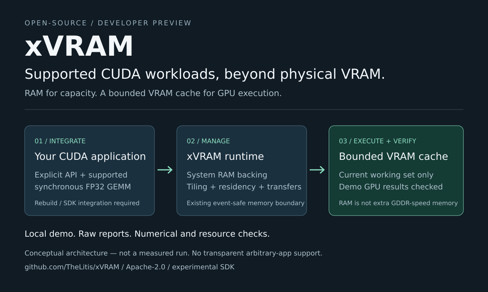

# xVRAM

**Supported CUDA workloads, beyond physical VRAM.**

An experimental, Windows-first C++20 SDK that keeps data in system RAM and uses
physical VRAM as a bounded execution cache. Applications integrate xVRAM explicitly;
each GPU operation sees a resident working set that fits the available budget.

[Download a developer preview](https://github.com/TheLitis/xVRAM/releases) ·
[Quick start](docs/preview/README.md) · [Evidence](docs/preview/EVIDENCE.md) ·
[Development with Astra](docs/preview/ASTRA.md)

> **Developer preview, not production software.** This is not a driver replacement,
> transparent VRAM expansion, or a way to run any unchanged application or model.
> The SDK remains `0.1.0-dev`. A preview tag identifies a distribution, not ABI stability.

## Try the focused preview

The Windows x64 package includes the SDK, a standalone public-C-API example,
CLI tools, app-local libraries and licenses, and a local report validator. It is
published only after the complete no-GPU CI matrix succeeds. That build validation
is **not** a new GPU benchmark. See [requirements and commands](docs/preview/README.md).

From the extracted package, after installing `requirements-preview.txt` into a
Python environment **outside** that directory:

```powershell
python preview.py verify
python preview.py smoke
python preview.py oversubscribe
```

`verify` checks package integrity only. `smoke` runs a small padded FP32 suite.
`oversubscribe` explicitly requests the larger-data test. Every real run creates a
new result folder with raw JSON, a trace, a run manifest and an offline HTML report.
A successful result requires the existing numerical/resource checks, source
revision agreement, complete trace and cleanup; the large test also requires
observed operand bytes above physical VRAM plus real eviction and frame reuse.
Missing GPU, timeout or insufficient memory is never presented as a pass.

You need Windows x64, a VMM-capable NVIDIA GPU and compatible driver, sufficient RAM,
Python 3.10+ and the Visual C++ x64 runtime. No OpenAI API key is required at runtime.
For the exact dependency and integration boundary, read the quick start first.

## What the preview does

The first distribution focuses on **explicit synchronous CUDA/cuBLAS integration**:
managed allocations and copies, and supported positive-dimension, column-major FP32
SGEMM with N/T operands. The existing tiled executor handles operands larger than
VRAM; compression is disabled in this profile. Applications must rebuild/integrate.

The [standalone example](examples/preview-gemm) uses installed public C headers and
`xVRAM::cuda_compat`, with a full CPU FP64 reference. It needs no private xVRAM or
NVIDIA development headers. The separate CUDA-name C++ facade does require NVIDIA
headers. See [the integration contract](docs/cuda-compat.md).

The documented RTX 3070 gate includes roughly **16 GiB of matrix operands on an
8 GiB GPU**, using tiling, not simultaneous 16 GiB VRAM residency. These are
maintainer-recorded results at an earlier source revision, not a fresh test of the
preview package. [Read the exact scope, numbers and evidence gaps](docs/preview/EVIDENCE.md).
No general speedup or universal capacity multiplier is claimed.

## How it works



```text
integrated CUDA application / supported framework adapter
                           |
                explicit working-set contract
                           |
             residency, transfers and tiled execution
                   /                       \
          system RAM backing       bounded physical VRAM cache
                                              |
                                          GPU kernels
```

The invariant is `WorkingSet(operation) <= available physical VRAM budget`.
Stable virtual addresses are not extra physical memory. Mappings cannot be reused
until the relevant GPU completion generation retires. PCIe-attached RAM is not as
fast as GDDR; capacity, transfer cost, reuse and compute overlap must be measured
for each supported workload.

## Scope across the repository

| Component | Boundary |
| --- | --- |
| C ABI, residency cache and tiled GEMM | Explicit managed memory and working sets. |
| PyTorch MemPool (4a) | Resident allocator only; no eviction of live tensors. |
| Static PyTorch inference (4b) | Narrow operator allowlist and static shapes; not arbitrary eager execution or training. |
| Lossless backing compression (5) | Opt-in paths; no universal compression ratio or speedup. |
| Explicit CUDA/cuBLAS integration (6a) | The focused preview scenario described above. |
| Unchanged-application audit (6b) | Diagnostic research, **not transparent execution support**. |

The [full engineering overview](DEVELOPMENT.md), [architecture](docs/architecture.md),
[correctness rules](docs/correctness.md) and [roadmap](docs/roadmap.md) retain the
implementation and acceptance history. The short overview above does not broaden
any supported contract.

## Build, verify, contribute

Use the [source build instructions](docs/preview/README.md#build-the-sdk-from-source)
for the preview, or [the full build guide](DEVELOPMENT.md#build) for other components.
CI covers Windows/Linux, Debug/Release, sanitizers, installed consumers and the
PyTorch Stable-ABI boundary. Hardware acceptance scripts are separate and require
the stated hardware/software environment.

Portable preview tests do not need CUDA or PyTorch:

```text
python -m pip install -r tests/requirements.txt
python -m unittest discover -s tests/preview -p "test_*.py" -v
```

[Contributing](CONTRIBUTING.md) · [Security](SECURITY.md) · [Privacy](PRIVACY.md) ·
[Product Hunt submission kit](docs/preview/PRODUCT_HUNT.md)

xVRAM is licensed under [Apache-2.0](LICENSE). See [NOTICE](NOTICE). Bundled
third-party components retain their own licenses. The project is not affiliated
with or endorsed by NVIDIA, OpenAI or Product Hunt; contest submission and
eligibility are separate from publishing this repository.
